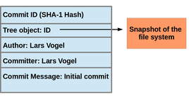

- Git manages changes to a tree of files over time

- Git is optimized for:
  - Distributed Development
  - Large file counts
  - Complex merges
  - Making trial branches
  - Being very fast
  - Being robust

- The SHA1 is king
  - objects consist of:
    - blob (the contents of the file)
    - tree (directories of blobs or other trees)
    - commit:
      - pointer to tree
      - pointer to parent commit
      - message explaining commit

- usually one commit in the repo that has no parent commit ("root" commit)

- The `.git` dir contains
  - `config` - Configuration file
  - `objects/*` - The ojbect repository
  - `refs/heads/*` - branches (e.g. `refs/heads/master`)
  - `refs/remotes/*` - remote tracking branches (e.g. `refs/remotes/origin/master`)
  - `index` - the "index cache"
  - `HEAD` - points to one of the branches (the current branch where commits go)

- All git commands start with `git` (e.g. `git add`, `git commit`)

- Creating a repo
  - git init
  - edit .gitignore
  - git add .
  - git commit
  - git branch
  - git log --all --decorate --pretty --graph
  - git show --summary HEAD
  - git show --summary master
  - git show --summary commit

- Cloning
  - creates a git repo from an existing repo
  - generally creates a subdirectory
  - your workflies and .git are in there
  - remote branches are "tracked"
  - remote HEAD branch checke out as your initial master branch as well
  - clone repo identifies as origin (just arbitrary default)

- Commiting:
  - Your work product is more commits
  - These are always on a branch
  - A branch is just a named commit
  - When you commit, the former branch head becomes the parent
  - The branch head moves to be the new commit
  - Thus youre creating a directele acyclic graph
  - a merge is a just a commit with multiple parents

- A git repoistory is simply a database containing all the information neeed to reatin and manage the revisions and history of a
  project

- Unlike most other VCSs, the git repoistory not only provides a complete working copy of all the files in the repostitory but
  also a copy of the repository itself with which to work

- Within a repository there are two primary data structures:
  - object store
  - index

- Each version of a file is represented as a blob. Blob, a contraction of “binary large object,” is a term that’s commonly used in
  computing to refer to some variable or file that can contain any data and whose internal structure is ignored by the program. A
  blob is treated as being opaque. A blob holds a file’s data but does not contain any metadata about the file or even its name.

- Blobs - Each version of a file is represented as a blob. Blob, a contraction of “binary large object,” is a term that’s commonly used in
  computing to refer to some variable or file that can contain any data and whose internal structure is ignored by the program. A
  blob is treated as being opaque. A blob holds a file’s data but does not contain any metadata about the file or even its name.

- Trees - A tree object represents one level of directory information. It records blob identifiers, path names, and a bit of metadata for
  all the files in one directory. It can also recursively reference other (sub)tree objects and thus build a complete hierarchy of
  files and subdirectories.

- Commits - Each version of a file is represented as a blob. Blob, a contraction of “binary large object,” is a term that’s commonly
  used in computing to refer to some variable or file that can contain any data and whose internal structure is ignored by the
  program. A blob is treated as being opaque. A blob holds a file’s data but does not contain any metadata about the file or even
  its name.

  Trees - A tree object represents one level of directory information. It records blob identifiers, path names, and a bit of metadata for
  all the files in one directory. It can also recursively reference other (sub)tree objects and thus build a complete hierarchy of
  files and subdirectories.

  Commits - A commit object holds metadata for each change introduced into the repository, including the author, committer, commit date, and
  log message. Each commit points to a tree object that captures, in one complete snapshot, the state of the repository at the time
  the commit was performed. The initial commit, or root commit, has no parent. Most commits have one commit parent, although later
  in the book (Chapter 9) we explain how a commit can reference more than one parent.


- Because the address space is so large and random, we can save typing using the first 7 characters of the SHA to Git (e.g.  `29933f2`) but scripts should use the full value.

- The index is transitory information, is private to a repository, and can be created or modified on demand as needed.

- A Git repository is simply a database containing all the information needed to retain and manage the revisions and history of a project.

- Git itself can be imagined as something that sits on top of your file system and manipulates files.

- Even better, you can imagine Git as a tree structure where each commit creates a new node in that tree.

- Nearly all Git commands actually serve to navigate on this tree and to manipulate it accordingly.

- As such in this tutorial I’d like to take a look at how Git works by viewing a Git repository from the point of view of the tree it constructs. To do so I walk through some common use cases like

- Distributed Version Control System (DVCS) created by Linus Torvalds in 2005 for the Linux Kernel

- Emphasis on speed, data integrity, and distributed workflows

- Very popular for open-source software projects


---

## Distributed Version Control

- Each developer has a local copy of the entire codebase and complete history in their `.git/` directory (repository)

- Operations such as commits, history, revert, branch, merge, diff are fast and isolated because they are local

- Isolation gives you more freedom to experiment and organize ideas and defer modifying upstream

- Each developer's local copy is a quasi-backup (from last time other developer's changes were "pulled")

---

## 3 Tier Architecture

.right[]

- **Working Directory** - The directory containing a versioned tree of files tracked in the repository.
  <br/><br/>
  Generally the top-level directory of the project and all its sub-directories and files except for the `.git`
  folder which is the embedded repository.

- **Staging Area (Index)** - Stages changes made in the Working Tree to be committed to the repository

- **Repository** - The `.git` directory. Contains all committed versions of the Working Tree, metadata, history, etc.

```
project_folder/ <--- Working Directory
  file1.txt
  file2.txt
  .git/         <---- Repository
    index       <---- Staging Area (Index)
    HEAD        <---- Points to tip of current branch commit ID
    refs/heads  <---- Holds local branch HEADs
    objects/    <---- Contains blob (file), tree (directory), and commit objects
```

???

- Working Directory - Master branch, HEAD

- Encourages clear, cohesive change history by allowing a subset of changed files (or even changed "chunks" in a file)
  to be grouped together in a commit.


---

## Working Directory File Status

A file in the working directory may be in one of the following states:

- **Untracked** - File was never staged or committed (not in repository)

- **Tracked** - File commited and not staged (**Not shown in status**)

- **Staged** - File staged to be included in next commit

- **Modified** - File changed but change is not staged

Run `git status` to view what state a file is in:

```
$ git status --short

|------ Column 1: Staging Area (Index)
 |------------------------------------- Column 2: Working Tree

??   file1.txt  # Untracked
A    file2.txt  # Staged new file
M    file3.txt  # Staged new change in tracked file
 M   file4.txt  # Modified (changed file but not staged)
 D   file5.txt  # Deleted from Working Directory but deletion not staged
D    file6.txt  # Deleted from Working Directory and deletion staged
```


---

## Staging a Change

Create a file and show status:

```
$ echo "Hi Mom" > README.md

$ git status --short
?? foo
```

Add file to the index and show status:

```
$ git add README.md

$ git status --short
A  foo
```

---

## Committing a Change

Commit the staged change:

```
$ git commit -m 'Add README.md'
[master 4d3fdc8] Add README.md
1 files changed, 1 insertions(+), 0 deletions(-)
create mode 100644 README.md
```

Show status:

```
$ git status --short
<empty>
```

---

## Commit Objects

.right[]

- A commit object (commit) represents a version of all files tracked in the repository at the time the commit was created.

- Commits know their parent(s) and this way capture the version history of the repository.

- In Git, a commit is very similar to a filesystem snapshot.

- A Git commit doesn't directly track files. It tracks snapshots of the entire file tree.

- A commit is identified by a Commit ID (SHA-1 Hash).

???

- What is special about the commit object in the diagram?

- The next commit would add a `parent` field with the Commit ID of this commit

---

## SHA-1 Hash

- SHA-1 is a secure hash algorithm published by NIST producing 160-bit hash value known as a "message digest"

- Each object stored in Git is run through SHA-1 algorithm and an object ID is generated

- Even varying one character in an object creates a totally different message digest, for example:
  ```
  echo 'hi mom' | sha1sum
  9f74809a2ee7607b16fcc70d9399a4de9725a727 -

  echo 'hi mom!' | sha1sum
  af543966f22c4c6d40c3060422e88b1b50bad42d  -

  ```

- If 2 objects generate the same message digest, this is called a hash collision. For SHA-1 it is astronomically improbable.


- ORIG_HEAD

- https://git-scm.com/book/en/v2

---

## Distributed versus Centralized

```bash
#!/usr/bin/env bash

for w in ${words}; do
  echo ${w}
done
```

---

## Initialize repository

    $ mkdir ~/project/teddy-wgs

    $ cd ~/project/teddy-wgs

    $ git init

    $ echo '# README' > README.md

- Get Help
  - `git help` - Show common sub-commands
  - `git help -a` - Show all sub-commands
  - `git help -g` - Show guides

- Configure your identity
  - `git config goba`

- Resources
  - http://ndpsoftware.com/git-cheatsheet.html#loc=stash; # cool visual exploration of git
  - https://github.com/git-tips/tips
  - Git Website/Book:  https://git-scm.com/

- Git is a distributed revision control system with an emphasis on speed, data integrity,
  and support for distributed, non-linear workflows created by Linus Torvalds in 2005 for development of the Linux kernel.

- Every Git working directory is a full-flegded repository with complete history and full version-tracking capabilities,
  indepededent of network access or a central server.

- Key feature of Git is that it maintains cryptographic authentication of history since the ID of a particular version
  (commit) depends upon the complete history leading up to that commit.

- Git has two data structures:
  1. Mutable index (aka "stage" or "cache") that tracks changes in working directory to be committed.
     The index serves as connection point between the object database and the working tree.

  2. Immutable append-only object database.

- The object database contains four types of objects:
  - A blob (binary large object) is the content of a file. Blobs have no file name, time stamps, or other metadata.
  - A tree object is the equivalent of a directory.
    It contains a list of file names, each with some type bits and the name of a blob or tree object that is that file,
    symbolic link, or directory's contents. This object describes a snapshot of the source tree.
  - A commit object links tree objects together into a history.
    It contains the name of a tree object (of the top-level source directory), a time stamp, a log message,
    and the names of zero or more parent commit objects.
  - A tag object is a container that contains reference to another object and can hold additional meta-data
    related to another object.  Most commonly, it is used to store a digital signature of a commit
    object corresponding to a particular release of the data being tracked by Git.


The index serves as connection point between the object database and the working tree.

Each object is identified by a SHA-1 hash of its contents. Git computes the hash, and uses this value for the object's name. The
object is put into a directory matching the first two characters of its hash. The rest of the hash is used as the file name for that
object.

Git stores each revision of a file as a unique blob. The relationships between the blobs can be found through examining the tree and
commit objects. Newly added objects are stored in their entirety using zlib compression. This can consume a large amount of disk
space quickly, so objects can be combined into packs, which use delta compression to save space, storing blobs as their changes
relative to other blobs.

A Git repository contains the history of a collection of files starting from a certain directory. The process of copying an existing Git repository via the Git tooling is called cloning. After cloning a repository the user has the complete repository with its history on his local machine. Of course, Git also supports the creation of new repositories.

A local repository provides at least one collection of files which originate from a certain version of the repository. This collection of files is called the working tree. It corresponds to a checkout of one version of the repository with potential changes done by the user.

---

The user can change the files in the working tree by modifying existing files and by creating and removing files.

A file in the working tree of a Git repository can have different states. These states are the following:

untracked: the file is not tracked by the Git repository. This means that the file never staged nor committed.

tracked: committed and not staged

staged: staged to be included in the next commit

dirty / modified: the file has changed but the change is not staged

After doing changes in the working tree, the user can add these changes to the Git repository or revert these changes.

HEAD is a symbolic reference most often pointing to the currently checked out branch.

