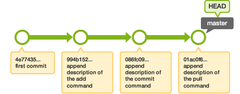

class: top

## Version Control with Git

.right[]

<br/>
Kevin Counts<br/>
Bioinformatics Engineering<br/><br/>

Health Informatics Institute<br/>
University of South Florida<br/>
<https://www.hii.usf.edu/>

---

## Version Control

<br/>

- A Version Control System (VCS) is a piece of software that helps manage a project's files

- It stores a base version of each file and tracks changes made to the file over a period of time called Revisions

- These changes are stored in a "Revision History" and can be rewound and played back against the base version

---

## Revision History stores Commits


As a file is changed, those changes are saved by the VCS in a series of commits which are stored *outside the file*.

---

## Commits allow concurrent editing


Once changes are managed outside the file, you can treat the file differently by playing
back different sets of changes.

For example, the set of green changes was made by "User A" and the red changes by "User B".

---

## Commits allow merging


Later the sets of changes are played against the same base file merging them into one.
Typically this works out well, but if both sets modify exactly the same location, a conflict may occur
and a human must decide which change "wins" to resolve the conflict.

---

## Git

.right[]

- Git is an open-source implementation of a Version Control System

- Very popular due to its speed and distributed nature

- No real "master" copy - each user has a complete copy of the Revision History on their local disk

- Most operations are performed locally with no network connection necessary

- Changes are synchronized between users by pushing and fetching changes to and from another copy
  of the Revision History called a "remote"

- A remote copy of the Revision History is often hosted at Github to centralize sharing of changes
  but no different than local copy on disk

- You can create a locally-hosted remote by initializing a directory with `git init --bare <path>`
  and specifying `file:///<path>` as the remote URI (the option `--bare` creates a Repository without
  the Working Tree)

---

## The 3 Areas

Git has 3 areas where file contents resides:

1. *Working Tree* - The project's top-level directory, sub-directories, and files from which the user reviews
   content and makes changes

2. *Index* - A hidden, dynamic, binary file (located in the Repository) where changes to files are staged for future commits

3. *Repository* - A special directory (usually named `.git/` located in the top-level of Working Tree) where commits are stored

---

## The 3 Areas

.right[]

Different git commands move changes in and out of the Working Tree, Index, and Repository allowing
gradual transitions from one complex repository state to another.

For example:
- `git add` - stages changes made in the Working Tree into the Index
- `git commit` - snapshots changes in the Index into a new Commit
- `git checkout` - modifies the Working Tree to match a revision in the Repository

*Note: The Working Tree is sometimes called the Working Directory. The Index is sometimes called the Staging Area or Cache.*

---

## Basic Example

To create a git project, we can initialize a project directory:

    cd ~/projects/acme
    git init .

This will create a `.git/` directory containing the Repository but leave all other files untouched.

The project directory `~/projects/acme` is the top-level of our Working Tree.

The Index where we will stage changes will be located in the special binary file `.git/index`.

---

## Staging/Commiting to the Repository

Lets presume we have one file in the Working Tree named `README.md`.

To add this to the Revision History we must:

1. Stage the file in the Index: <br/>
   `git add README.md`

2. Commit the staged change into the Repository: <br/>
   `git commit -m 'Add README.md'`

We now have the beginning of the Revision History which can be viewed with the `git log` command:

    $ git log
    commit 17e8ca945e8e80ed0b701e15d0dcffcce35fe657
    Author: Kevin Counts <counts@digicat.org>
    Date:   Sat Jul 7 11:04:34 2018 -0400

        Add README.md

Now lets make another change to `README.md`...

---

## Commit Graph

If we make another change to `README.md`, stage the change in the Index with `git add` and commit the change with `git commit`, that new commit will store a pointer to our first commit building a chain.

In the diagram, a single branch named master has a 4-commit revision history with `4e77435` as the initial commit and `01ac0f6` as the most recent commit.

The branch `master` points to the latest commit and `HEAD` points to the branch `master`.

`HEAD` tells Git what will be the parent of your next commit and so we say we are currently "on" the branch `master`.

Note the arrows pointing left-to-right in the diagram represent time, but the commit graph would be arrows pointing right-to-left (towards the past).



---

## The 3 Object Types

The Commit Graph is composed of 3 Object Types.

- A Commit which contains:
   - Pointer to a Tree (snapshot of the project at time of Commit)
   - Pointer to a Parent Commit (establishes chain of Revision History)
   - Commit Message, Author, and Date

- A Blob which contains contents of a file

- A Tree which contains contents of a directory

---

## Blob

When a file changes are added to the Index, Git runs a special SHA-1 Hash Algorithm computing
a unique identifier based on the the contents of the file.

You can generate your own SHA-1 identifer from the CLI: <br/>
```
$ echo '# Project Acme' | git hash-object --stdin
6fbcbe046ef6288521d4559c35da541cf4ea428c
```

If you make even a small change, the SHA-1 identifer changes drastically:
```
$ echo '# Project Acme 2' | git hash-object --stdin
1c833668f7b54e5993df11c3934f6c0a78d7f41f
```

A SHA-1 identifier is guaranteed to be unique for each unique content. Therefore two files
with the same content areonly stored once (but the names pointing to the content will differ within the Tree objects).

---

## Blob (cont.)

Git stores the blob based on its SHA-1 within its repository:

For example the file with the content `# Project Acme` would be stored at:
```
.git/objects/6f/bcbe046ef6288521d4559c35da541cf4ea428c
```

You can display the contents of a Blob by using the command `git cat-file -p <id>` and its type with `git cat-file -t <id>` , for example:
```
$ git cat-file -p 6fbcbe046ef6288521d4559c35da541cf4ea428c
# Project Acme

$ git cat-file -t 6fbcbe046ef6288521d4559c35da541cf4ea428c
blob
```

---

## SHA-1 Collision

If two files with different content create the same SHA-1, the first one to be added will win and we would experience a "Hash Collision" as the second file's content would be silently ignored and never saved.

The chance of 2 different contents creating the same SHA-1 value is astronomically small.
If 1 million users created a new file every second of the day and night it would take 38 billion years
before it was likely a collision would occur. The Sun will turn into a Red Giant and consume the Earth in 7.6 billion years.
```
$ echo 'users=10^6; keyspace=2^80; files_per_year=365*24*60*60; \
        keyspace / (users * files_per_year) / 10^9' | bc -q
38
```


---


##

**Ensures cryptographic integrity**

--

- Every object stored in a Git repository has an object ID<br/>(e.g. `29933f2c3c2653cac59b4d7d325830e6f9fe3f04`)

--

- The object ID is generated from the object's content creating a unique 40 character, 160-bit "Message Digest" or "Checksum Hash"

--

- Since the algorithm Git uses to create this is the Secure Hash Algorithm (SHA-1), the object ID is referred to as simply the "SHA"

--

- The objects are stored in the repository with their filename set to their object ID, Hash, or as we will now refer to their "SHA" (e.g. `.git/objects/29/933f2c3c2653cac59b4d7d325830e6f9fe3f04`).

--

- This is called "Content Addressable Storage" (CAS) because you reference an object not by a human-readable filename but by its unique SHA that was generated based on its content.

--

- The chance of two objects generating the same SHA, called a Hash Collision, is so mathematically improbable that it is considered practically impossible to ever occur

--

- The commit history uses the SHA of its ancestor as well as the SHAs of all referenced trees and files to calculate its own SHA - this creates a verifiable chain ensuring cryptographic integrity


## What is Git?

**Ensures cryptographic integrity**
