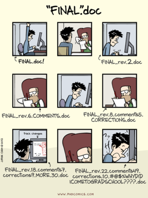

class: top

## Version Control with Git

.right[]

 
Kevin Counts 
Systems Engineering
 
 
Health Informatics Institute 
University of South Florida 
https://hii.usf.edu/

---

## Version Control

.right[]

--

**DISCLAIMER:**

- When we use the term "document" in this presentation we limit this to text and source code files to demonstrate the full power of
  a Version Control System

- Git handles binary documents as well such as Word, Excel, or Images but there may be some operations (e.g. merges or diffs) that would not apply

---

## Version Control

.right[]

--

- Most workflows for editing a shared document start out with individuals making edits out of a shared network folder

--

- To avoid losing their work or causing the loss of work by others, before starting their edits, the person contacts the other people to make sure they all know "its their turn" to edit the document

--

- All other edits on this document are stopped while the person has their turn, once complete, the cycle continues

--

- These practices may be "good enough" for some workflows but as more users edit more of the same documents more frequently, the need for a better system will become unavoidable

---

## Version Control

- Version control systems start with a base version of the document and then save just the changes you made at each step of the way.

--

- You can think of it as a tape: if you rewind the tape and start at the base document, then you can play back each change and end up with
your latest version.

---

## Version Control

- Once you think of changes as separate from the document itself, you can then think about “playing back” different sets of changes onto the base document and getting different versions of the document.

- For example, two users can make independent sets of changes based on the same document...

---

## Version Control

- ... and unless there are conflicts, you can even play two sets of changes onto the same base document.

---

## Version Control

To expand...

- A Version Control System is a tool that keeps track of these changes for us and helps us version and merge our files.

--

- It allows you to decide which changes make up the next version, called a commit, and keeps useful metadata about them.

--

- The complete history of commits for a particular project and their metadata make up a repository.

--

- Repositories can be kept in sync across different computers facilitating collaboration among different people.

---

## What is Git?

---

## What is Git?

- Version Control System

--

- Distributed

--

- Supports non-linear development

--

- Ensures cryptographic integrity

---

## What is Git?

**Version Control System (VCS)**

--

- Software that manages the state of a folder's contents over time

--

- The managed folder is called the Working Tree (e.g. `~/projects/teddy-human-wgs/`)

--

- As files are added, removed or modified in the Working Tree, versioning is accomplished by creating "Commits" which snapshot the state of all the files at that moment in time

--

- Each commit is stored in a repository which is a hidden folder named `.git/` under the Working Tree (e.g. `~/projects/teddy-human-wgs/.git/`)

--

- Version history is established by each commit having a reference to its parent commit forming a "Commit Graph" pointing back in time (e.g. `c1 <- c2 <- c3 <- c4`)

---

## What is Git?

**Distributed**

--

- Each user has a full local copy of the repository and all history

--

- Almost all operations can be performed locally without network connectivity

--

- For collaborative work, a copy of the repository called a "remote" is established

--

- Changes are "pushed" and "fetched" through the remote for sharing

--

- Github is often chosen to host the remote but using Git does not require Github

---

## What is Git?

**Supports Non-Linear Development**

--

- Efficient and powerful branching model

--

- Uses object-tree model with lightweight pointers yielding almost instant branch operations

--

- Development branches easily and inexpensively created, switched, merged, or thrown-away

--

- In Git, every line of history is tracked through at least one branch (default is "master")

--

- The starting branch "master" may be thought of as the main trunk of the tree but is no different in function than any other branch

---

## What is Git?

**Ensures cryptographic integrity**

--

- Every object stored in a Git repository has an object ID (e.g. `29933f2c3c2653cac59b4d7d325830e6f9fe3f04`)

--

- The object ID is generated from the object's content creating a unique 40 character, 160-bit "Message Digest" or "Checksum Hash"

--

- Since the algorithm Git uses to create this is the Secure Hash Algorithm (SHA-1), the object ID is referred to as simply the "SHA"

--

- The objects are stored in the repository with their filename set to their object ID, Hash, or as we will now refer to their "SHA" (e.g. `.git/objects/29/933f2c3c2653cac59b4d7d325830e6f9fe3f04`).

--

- This is called "Content Addressable Storage" (CAS) because you reference an object not by a human-readable filename but by its unique SHA that was generated based on its content.

--

- The chance of two objects generating the same SHA, called a Hash Collision, is so mathematically improbable that it is considered practically impossible to ever occur

--

- The commit history uses the SHA of its ancestor as well as the SHAs of all referenced trees and files to calculate its own SHA - this creates a verifiable chain ensuring cryptographic integrity

## What is Git?

**Ensures cryptographic integrity**
