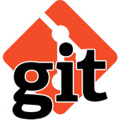
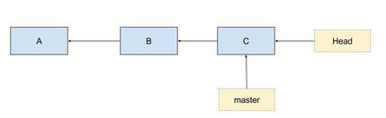
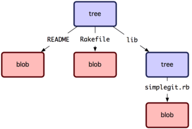
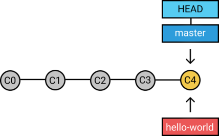
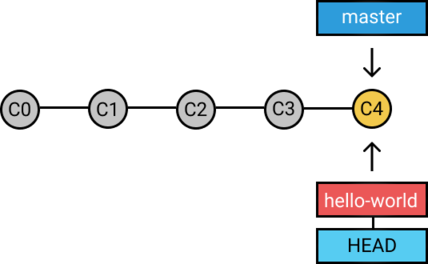
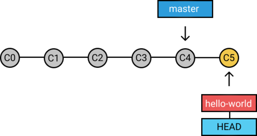
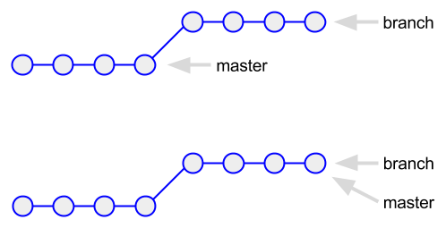
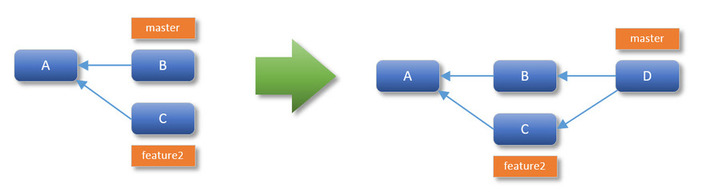

class: top

## Git Concepts

.right[]

<br/>
Kevin Counts<br/>
Bioinformatics Engineering<br/><br/>

Health Informatics Institute<br/>
University of South Florida<br/>
<https://www.hii.usf.edu/>

---

## Version Control

- A *Version Control System* records changes to a set of files over time so that you can recall specific versions later

- It records a base version of each file and tracks changes in series of revisions

- Users choose what makes a new file revision by periodically creating a *Commit*, a point-in-time snapshot of the files

- These commits along with the file revisions are stored in a *Repository*

- The commits and revisions in the *Repository* form a *Revision History*

- The changes from the *Revision History* can later be rewound and played back against the base versions
  to create different point-in-time representations of the files

- A VCS is designed to work with text-based files - not binaries such as JPEG Images, Word Documents, Excel Documents

- Binary files can be tracked but not all operations are supported (no human-readable diffs, no merging of multiple commits, etc.)

---

## Revision History

- As files are changed, those changes are saved by the VCS in a series of commits/revisions
 which are stored **outside the file** in a *Repository* forming the *Revision History*


---

## Concurrent editing


- Once changes are managed outside the file, you can treat a file differently by playing
 back different sets of changes

- For example, the set of green changes was made by "User A" and the red changes by "User B"


---

## Merging Changes

- Later the changes from "User A" and "User B" are played against the same base file merging them into one

- This is a "Killer Feature" of a VCS - Users can edit the same file at the same time and merge them later


---

## Merge Conflict

- Merges usually work well but if both users change exactly the same location in the file a *Merge Conflict* may occur

- The user merging must decide which change "wins" to resolve the conflict.


---

## Git

.right[]

- Git is an open-source implementation of a Version Control System

- Very popular due to its speed and distributed nature

- No real "master" copy - each user has a complete copy of the Revision History in their Git Repository on local disk (`.git/`)

- Almost all operations are performed locally with no network connection necessary

- Changes in the local Repository are often pushed to and fetched from another copy of the Repository called a "remote"
  which is no different in nature than the local copy (just located "remotely")

- A common remote is a GitHub project

- *Note that GitHub is not Git* - it is an optional service that many people choose to conveniently host a copy of their Repository -
  you can make your own remote in another location on disk or on another computer and access it with `file:///<path>` or `ssh://<user>@<host>:<path>`.


---

## Git Model

- Areas
  - Working Tree
  - Index
  - Repository

- Objects
  - Blob
  - Tree
  - Index

- References
  - Local Branches (refs/heads)
  - Remove Branches (refs/remotes)

- *HEAD* - pointer to last Commit


---

## The 3 Areas

Git has 3 areas where file contents resides:

1. *Working Tree* - The project's top-level directory, sub-directories, and files which the user edits and changes

2. *Index* - A hidden, dynamic, binary file (`.git/index`) where changes to files in the Working Tree are staged for commit

3. *Repository* - A top-level, hidden directory (`.git/`) containing all the Commits and File Revisions of the project (Revision
   History)


---

## The 3 Areas

.right[]

Different git commands move changes in and out of the Working Tree, Index, and Repository allowing
gradual transitions from one complex repository state to another.

For example:
- `git add` - stages changes made in the Working Tree into the Index
- `git commit` - snapshots changes staged in the Index into a new Commit
- `git checkout` - modifies the Working Tree to match a revision in the Repository

Note:
- *The Working Tree is sometimes called the Working Directory*
- *The Index is sometimes called the Staging Area or Cache*

---

## Basic Lifecyle

1. Files are changed in the Working Tree

2. Changes are staged in the Index

3. Changes in the Index are committed to the Repository

*Note:*

- When things are "clean" - the files in the Working Tree, Index, and most recent Commit in the Repository (`HEAD`) will be identical.

- Users use `git status` on a frequent basis to examine the state of the Working Tree, Index, and `HEAD` as they make changes to files.

---

## Example

To create a git project, we can initialize a project directory:
```
$ cd ~/projects/acme
$ git init .
```

This will create a `.git/` directory containing the Repository but leave all other files untouched.

The project directory `~/projects/acme` is the top-level of our Working Tree.

The Index where we will stage changes will be located in the special binary file `.git/index`

---

## Staging/Commiting to the Repository

Lets presume we have one file in the Working Tree named `README.md`.

To add this to the Revision History we must:

1. Stage the file in the Index: <br/>
   `git add README.md`

2. Commit the staged change into the Repository: <br/>
   `git commit -m 'Add README.md'`

We now have the beginning of the Revision History which can be viewed with the `git log` command:

    $ git log
    commit 17e8ca945e8e80ed0b701e15d0dcffcce35fe657
    Author: Kevin Counts <counts@digicat.org>
    Date:   Sat Jul 7 11:04:34 2018 -0400

        Add README.md


---

## Commit Graph

Now lets make another change to `README.md` by adding a new line of text and:
1. Stage the change in the Index: <br/>
   `add README.md`
2. Commit the change: <br/>
   `git commit -m 'Add new line to README.md'`

This new commit, `Commit B`, will store a pointer to our first commit `Commit A` and start building a chain.

If we did this one more round, we would create `Commit C` linking to `Commit B` and have something like the diagram below.

The branch that `HEAD` points to is what Git uses for the parent of the next commit. We say we are on the `master` branch
because `HEAD` points to `master` which points to its head, `Commit C`. From there we can walk back one commit at a time
to the initial commit, `Commit A`.



---

## The 3 Objects

Git maintains the Revision History with 3 types of objects:

- A *Blob* which holds the contents of a file

- A *Tree* which maps files and sub-directories to Blobs and other Trees

- A *Commit* which contains:
  - A pointer to a Tree (Snapshot of top-level directory)
  - A pointer to its parent commit
  - A text field with a Message, Author and Date

---

## The SHA

- Git objects are stored and referred to by a unique 40-character identifier based on the files content

- The algorithm used is the Secure Hash Algorithm 1 (SHA-1) and therefore we refer to an Object's "SHA" which is really its Object ID

- If two identical files with different names are run through the SHA-1 hash function, they will generate the same SHA and be stored in Git only once.

You can generate your own SHA-1 value from the CLI: <br/>
```
$ echo '# Project Acme' | git hash-object --stdin
6fbcbe046ef6288521d4559c35da541cf4ea428c
```

So regardless of name, if you added a file `a.txt` and `b.txt` to Git with the same content `# Project Acme` in each, it would be stored once at:
```
.git/
  - objects/
     - 6f/
       - bcbe046ef6288521d4559c35da541cf4ea428c
```

---

## SHA Collision

- If two files with different content create the same SHA we would experience a "Hash Collision"

- The first file to be added would have its contents copied and the second file's content would never be saved since Git would see the object was already there.

- The chance of 2 different files creating the same SHA is incredibly small

- To give perspective, if 1 million users each created 86,400 unique files per day, it would take 38 billion years
before it was likely two different files would create the same SHA

- The Sun will turn into a Red Giant and consume the Earth in 7.6 billion years


---

## The Blob Object

- A Blob stores the contents of a file

- Blob stands for "Binary Large Object" and the term comes from databases

- There is no file name associated with a blob - just a SHA (e.g. `.git/objects/6f/bcbe046ef6288521d4559c35da541cf4ea428c`)
  which is its Object Identifier

- File names and directory names are stored in Trees with pointers to their Blob/Tree SHA

- If you have two or more copies of the same file Git will only store one copy internally

- If you have two files which differ only by one character, Git will store two Blobs

- Git uses different compression techniques downstream to minimize this potential for wasted-space

---

## The Tree Object

- A Tree represents a single level of directory information including
  Blob and Tree SHAs along with their filenames.



```
$ git ls-tree f8a9568
100644 blob 060c4d9  README
100644 blob b173668  Rakefile
040000 tree fd87268  lib

$ git ls-tree fd87268
100644 blog dec9268  simplegit.rb
```

---

## The Commit Object

A Commit contains:
- A pointer to a Tree (Snapshot of top-level directory)
- A pointer to its Parent (unless its the root commit)
- A Commit Message
- Author, Committer, and Date Information


---

## The Commit Object

A series of linked commits each pointing to
a  top-level Tree which snapshots the state of all files at a point-in-time.

<br/>


---

## Branches

- A Git branch (sometimes called a branch head) is a lightweight, moveable pointer to a commit

- The default branch name is master but it is not special

- When you are on a branch, every time you commit, Git updates the branch to point to the new commit

Here is how Git tracks the latest commit on the master branch:
```
$ cat .git/refs/heads/master
17e8ca945e8e80ed0b701e15d0dcffcce35fe657
```

And we know we are "on" the master branch because `HEAD` references it:

```
$ cat .git/HEAD
ref: refs/heads/master
```

---

## Branches

To create a second branch, lets run the command: `git branch hello-world`

This will create a branch named `hello-world` pointing to the same commit as `HEAD` by default.



---

## Branches

New commits will still be on the master branch, so to perform development on hello-world we
need to use "git checkout":
```
$ git checkout hello-world
```

Now `HEAD` points to the `hello-world` branch.

<br/>



---

## Branches

- Now when we make `Commit C5`, the `hello-world` branch advances but `master` does not

- This is because `HEAD` points to `hello-world` so the next commit only advances the branch we are on

<br/>



---

## Merging

- Finally we want to merge the change we made on `hello-world` back into `master`

- We checkout `master` and merge `hello-world` *into* it

```
$ git checkout master

$ git merge hello-world
```

---

## Fast-Forward Merge

- In the previous example, Git would perform a fast-forward merge

- This happens when:
  - You create an alternate branch (named 'branch' in the diagram)
  - Make one or more commits on alternate branch
  - Checkout master (or whatever branch u wish to merge back into) and merge the alternate branch **before** any other commits are made to master

The only thing Git has to do to merge is advance the commit `master` points to.



---

## Recursive Merge

- If both branches have been changed, Git needs to perform a recursive merge playing changes from each branch into a new Merge
  Commit (`D`)

- The Merge Commit records pointers to two Parents (`B` and `C`)

<br/>



---

## Git Reset

- `git reset` (default implies *--mixed HEAD*) - Copies all tracked files from `HEAD` into the Index (unstages all changes in Index)

- `git reset --soft HEAD~1` - Change `HEAD` to previous commit but do not touch Index or Working Tree - any changes since the previous commit are left staged in Index

- `git reset --mixed HEAD~1` - Change `HEAD` to previous commit and copy entries from new `HEAD` into Index

- `git reset --hard HEAD~1` - Change `HEAD` to the previous commit, copy entries from new `HEAD` into Index *and* Working Tree (Destructive)

One technique I use to squash commits - for example here I squash the last 4 local commits into one:
```
$ git reset --soft HEAD~4
$ git commit -m 'New message'
```

*Note: This rewrites history so use this technique only for local cleanup **before** pushing upstream*


<!-- Notes

- This makes us understand something very important: an object, whatever it is, will always have the same hash in any repository, in
  any computer, on the face of the Earth.

## Version Control with Git
## Version Control
## Revision History
## Concurrent editing
## Merging Changes
## Merge Conflict
## Git
## The 3 Areas
## The Basic Lifecyle
## Example
## Staging/Commiting to the Repository
## Commit Graph
## The 3 Objects
## The SHA
## SHA Collision
## The Blob
## The Tree
## Commit
## Commit (cont.)
## Other

-->
